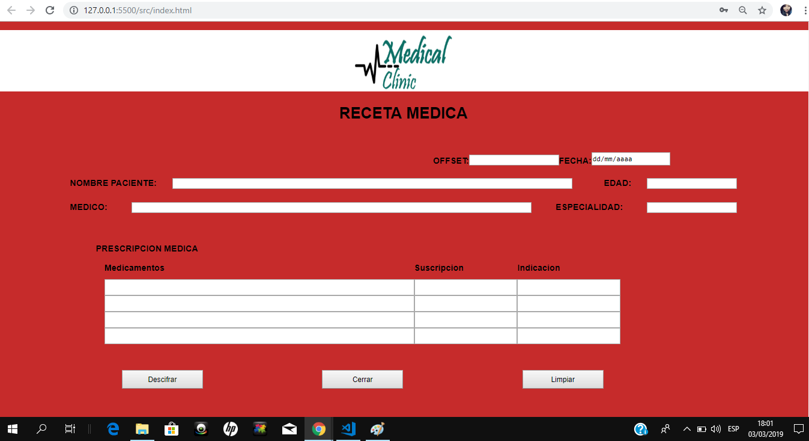

				Medical Clinic Cipher

-cuéntanos cómo pensaste en los usuarios y cuál fue tu proceso para definir el producto final a nivel de  experiencia y de interfaz.

Medical clinic Cipher se crea en base a la necesidad de proteger la informacion que se maneja en los centros de salud y tambien en
el negocio Farmaceutico. 

Es por ello, que para proteger y generar mayor confianza al usuario principal (pacientes) a la hora de 
hacer una consulta medica y que se genere una receta medica sea mas seguro el compartir informacion no solo del paciente sino tambien
del contenido de una receta medica.

En la actualidad el sistema de Salud lamentablemente no es uno de los mejores, y ni que hablar del gran monopolio farmaceutico que no
genera la confianza necesaria a la hora de adquierir un producto farmaceutico asi tambien existe una gran cantidad de personas que 
intentan lucrar con la salud de los usuarios finales(pacientes).

En base a este gran problema y la necesidad que el usuario sienta confianza a la hora de obtener farmacos en una farmacia autorizada 
en donde no le vendan medicamentos vencidos o de dudosa procedencia y que el establecimiento tenga las garantias necesarias para expedir 
los farmacos es que se creo Medical Clinic Cipher.

Para se mas exactos, Medical Clinic cipher es una pagina web que es accedida solamente por Medicos de clinicas, Hospitales y Centros de 
salud autorizados y asi mismo por Farmacias que tengan todos los controles y garantias otorgadas por entidades encargadas de fiscalizar.
Se puede acceder a Medical Clinic Cipher unicamente con un usuario y una contraseña, en donde se mostrar un formulario vacio de una receta
medica, que debe ser llenado pr el medico que atiende al paciente y al terminar cifrar el contenido de la receta, enviarlo y entregar al 
paciente un codigo.

Posteriormente el paciente puede acercarse a cualquiera de las Farmacias autorizadas, unicamente entregando un codigo que le proporciono
el medico que lo atendio.

Las Farmacias podran acceder a la receta y con previa verificacion se desencriptara la receta y se podra vender el producto al paciente.

la experiencia para los usuario(paciente) es otorgarle mayor  comodidad y seguridad a la hora de adquirir un producto, y que este no sea 
un producto de dudosa calidad.En cuanto a la interfaz se busca que sea super intuitiva, sin que el Medico o el Farmaceutico tenga necesidad
de hacer malabares para acceder a la plataforma.

- Quiénes son los principales usuarios de producto.

existen dos principales usuarios: 
* El Medico.- que se encargara de recetar al paciente y proporcionar la receta medica encriptada mediante un codigo.

* el Farmaceutico.- que podra acceder a la receta medica unicamente si este tiene un usuario y password autorizados 
con anterioridad y podra descifrar la receta y porteriormente vender el producto que le fue recetado al paciente.

- Cuáles son los objetivos de estos usuarios en relación con tu producto.

Principalmente creo que uno de los objetivos es darle una buena atencion a los pacientes dandole seguridad y garantias de adquierir un buen
 producto y que toda su informacion sea confidencial.

- Cómo crees que el producto que estás creando está resolviendo sus problemas.

Principalmente es que resuelve el tema relacionado a la atencion del Cliente, y tambien la informalidad en los negocios farmaceuticos, 
y en centros medicos que aveces operan de forma clandestina.

En lo ambiental se resuelve la necesidad de estar recetando en hojas de papel lo que reduciria el uso de hojas impresas de recetas medicas.

